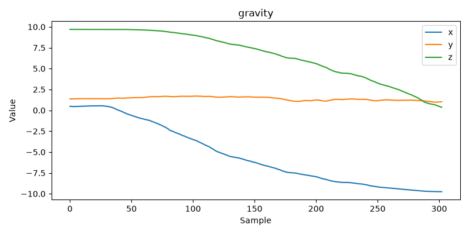
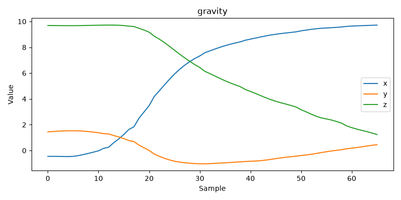
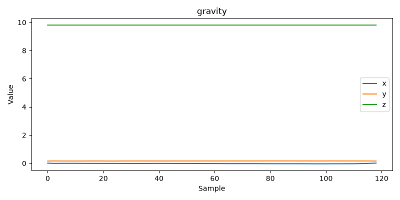
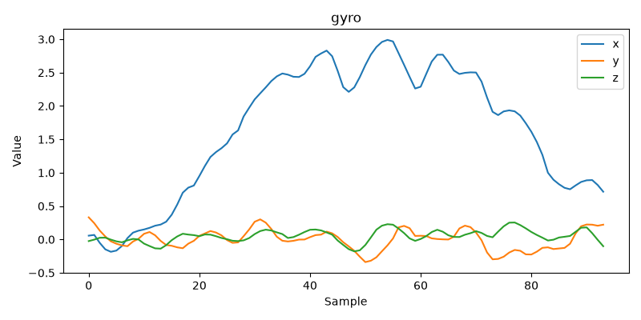
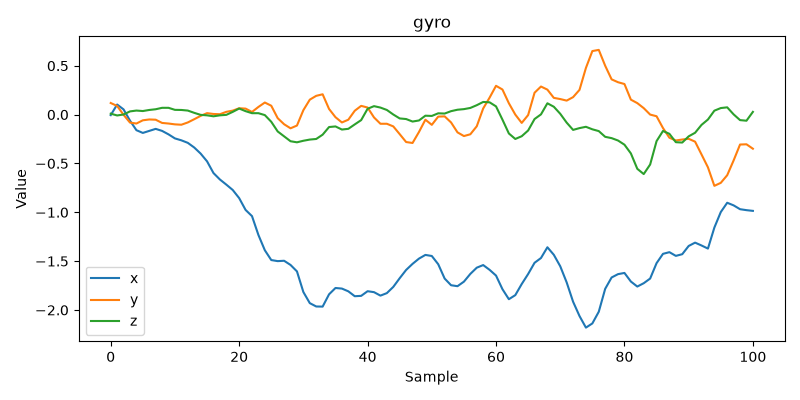

# 1. Paper Selection
### Selection process
Out of the remaining papers, we selected one from Ilias and two others by searching for papers on interaction techniques, filtering out those that could not be replicated within two weeks. We then evaluated them based on different criteria to make our final decision.

We evaluated the three candidate papers using the following criteria:
- **Scroll, Tilt or Move It: Using Mobile Phones to Continuously Control Pointers on Large Public Displays**
    - **Interaction concept:** Uses a mobile phone as an input device for controlling a cursor on a large display by scrolling, tilting, or moving the phone, providing multiple interaction techniques. 
    - **Hardware requirements:** A mobile phone with standard sensors (accelerometer/gyroscope) and DIPPID installed.
    - **Implementation effort:** Moderate and feasible to implement within two weeks. The sensor data can easily be read using DIPPID, and the focus is on implementing and evaluating the mouse controls.
    - **Possible extensions:** Different pointer control modes, presentation controls, or a demonstration game.
    - **Suitability for a live demo:** Very high. Using a mobile phone as a wireless pointer is immediately understandable and can be used for an interactive live demonstration, as well as during the presentation itself.

- **Effective 2D Stroke-based Gesture Augmentation for RNNs**
    - **Interaction concept:** Focuses on ML data augmentation to improve recognition accuracy rather than proposing a new interaction technique.
    - **Hardware requirements:** No special hardware required.
    - **Implementation effort:** Moderate and feasible to implement within two weeks. This involves implementing the augmentation methods, preprocessing the data, training the RNN, and evaluating the results.
    - **Possible extensions:** Augmentation of custom gestures.
    - **Suitability for a live demo:** Low. Evaluating dataset augmentation on an RNN's accuracy is more difficult to showcase in a live demonstration compared to an interactive technique.

- **A Technique for Touch Force Sensing using a Waterproof Device's Built-in Barometer**
    - **Interaction concept:** Estimates touch pressure using a mobile phone's built-in barometer to provide force-sensitive touch input.
    - **Hardware requirements:** A mobile phone with a built-in barometer. Since one of our phones lacks this sensor, implementation is not possible for the whole team.
    - **Implementation effort:** Moderate to high but feasible to implement within two weeks. It requires more effort to access the barometer data on Android, though implementing the core interaction technique remains viable.
    - **Possible extensions:** A pressure-sensitive drawing application.
    - **Suitability for a live demo:** Very high. Force-sensitive touch input is highly intuitive and lends itself well to an interactive live demonstration with a drawing application.

Based on the comparison above, we selected *Scroll, Tilt or Move It: Using Mobile Phones to Continuously Control Pointers on Large Public Displays*. Although the other papers offered interesting concepts, this paper provided the best balance between implementation effort, hardware availability, and demonstration value. Unlike the barometer-based approach, it does not require specialized hardware, allowing every group member to develop and test the implementation. In contrast to the gesture augmentation paper, it focuses on an actual interaction technique rather than a machine learning problem, making it more suitable for the course and the live demonstration. The system can easily be extended with additional control modes and demonstrated live by using a smartphone as a wireless pointer during our presentation or within a pointer application/game, making the project both practical and engaging.

### Citations
Sebastian Boring, Marko Jurmu, and Andreas Butz. 2009. Scroll, tilt or move it: using mobile phones to continuously control pointers on large public displays. In Proceedings of the 21st Annual Conference of the Australian Computer-Human Interaction Special Interest Group: Design: Open 24/7 (OZCHI '09). Association for Computing Machinery, New York, NY, USA, 161–168. https://doi.org/10.1145/1738826.1738853

Mykola Maslych, Eugene Matthew Taranta, Mostafa Aldilati, and Joseph J. Laviola. 2023. Effective 2D Stroke-based Gesture Augmentation for RNNs. In Proceedings of the 2023 CHI Conference on Human Factors in Computing Systems (CHI '23). Association for Computing Machinery, New York, NY, USA, Article 282, 1–13. https://doi.org/10.1145/3544548.3581358

Ryosuke Takada, Wei Lin, Toshiyuki Ando, Buntarou Shizuki, and Shin Takahashi. 2017. A Technique for Touch Force Sensing using a Waterproof Device's Built-in Barometer. In Proceedings of the 2017 CHI Conference Extended Abstracts on Human Factors in Computing Systems (CHI EA '17). Association for Computing Machinery, New York, NY, USA, 2140–2146. https://doi.org/10.1145/3027063.3053130

# 3. Documentation

## Dependencies

We recommend using Python 3.14 to run the code implementation, but older versions should also work.

To install all the dependencies, run the following commands:

```bash
python -m venv .venv
.venv/Scripts/activate
pip install -r requirements.txt
```

## Development process
### Scroll, Tilt or Move It
The paper by Sebastian Boring, Marko Jurmu, and Andreas Butz describes three techniques for interacting with a large screen display from a distance using a mobile phone or smartphone. The interaction techniques become increasingly complex, and each has its own advantages and disadvantages. The techniques are as follows:

- **Scrolling:** The cursor on the display is moved by pressing keys on the mobile phone, such as the arrow keys on older devices. On modern smartphones, this can be mapped to virtual buttons on the touch display. As long as a key or button is pressed, the cursor moves in the corresponding direction (up, down, left, or right).
- **Tilting:** Using the built-in sensors of the smartphone, the user can tilt the phone along the X- and Y-axes to move the cursor. Depending on the tilt angle, the cursor moves faster or slower, similar to the analog stick of a gaming controller.
- **Moving:** In the paper, the phone's camera is used to detect the physical movement of the device in space. This linear movement is directly mapped to the position of the cursor, meaning the user controls the speed of the cursor by how fast the phone is moved through the air. While this is the most interesting aspect of the paper, the camera-based implementation is rather difficult. However, we believe we can improve upon this by utilizing the advanced sensors available in modern smartphones, such as the gyroscope, accelerometer, or gravity sensor.

### Implementation - Scrolling
The implementation of the scrolling mechanism is straightforward and does not require extensive thought, as we have already solved similar problems using the DIPPID framework in previous assignments. Nevertheless, this served as a good starting point to get a feeling for the problem.

For the actual implementation, we import the DIPPID framework and define a class with the appropriate callback functions for the buttons in the DIPPID app. We have two global variables, `x` and `y`, which are initially set to 0. Each button handler sets one of these variables to +1 or -1 when a button is pressed, and resets it to 0 as soon as the button is released. The main logic, if it can be called that, is in the `run()` function. Here, we have a `while True` loop that runs indefinitely, moving the cursor in the X and Y directions according to the global variables every 0.01 seconds. The speed of the cursor movement can be adjusted via the sensitivity, which acts as a multiplying factor for the global variables `x` and `y`. That is the entire, highly simple implementation.

Since the solution is so simple, we encountered virtually no challenges or struggles. We also did not need to write multiple iterations of code to get this solution running. We merely optimized it slightly for better readability and added more comments over time.

Since this is only the first interation on the interaction technique described by Borind, there are some limitations. 
- Movement of cursor has only one speed
- Diagonal movements are difficult
- All DIPPID buttons are occupied, no more functionality can be implemented

DIPPID Button mappings:
- Button 1: Moves cursor to the left
- Button 2: Moves cursor up
- Button 3: Moves cursor down
- Button 4: Moves cursor to the right

To run the scrolling tracker, execute the following command:
```PowerShell
python ./implementation/scrollTracker.py
```
You can exit the program at any time by pressing ESC.

### Exploration
Since interpreting sensor data can be quite tricky, we figured it makes sense to write a small program that collects sensor data for specific movements and plots the collected data. This is exactly what we did in the `exploration.py` file. Simply run the file with one of the following commands:

```PowerShell
cd .\implementation\
python .\exploration.py 
python .\exploration.py --location <locationname> --file_name <filename>
```

To record a specific movement you can either hold button 2 and execute the movement and then as soon as you release the button, the plots are scored. The second option is to click button 1 once, execute the movement and then click button 1 again to safe the recording.

Since there were some problems with matplotlib we cannot close the code by ESC, we tried implemeting this for a while but were not able to do so. Just close the code by STRG + C in the console. Maybe you need to do this multiple times.

### Implementation - Tilting
To implement the tilting tracker, we look at the plots collected during the exploration phase. In the paper, the accelerometer is used to detect the tilting motion in one direction. Interestingly, we found that the gravity sensor on the smartphone we are using produces curves whose overall trend looks nearly identical while being much smoother at the same time. Therefore, we chose to use the gravity sensor for the tilting tracker instead of the accelerometer.

If we look at the plot `tilt_x_right_gravity.png`, we can see that the X and Z values decrease for a tilting motion to the right.


If we compare this to the plot `tilt_x_left_gravity.png`, we can see that the Z value still decreases, but the X value increases instead.


The next important piece of information we need is what values the gravity sensor produces when the phone lies flat on a table. We can see this in the plot `flat_gravity.png`.


With this information, we can solve the riddle of how to adjust the cursor position for the different tilting motions. We apply a very similar logic to the scrolling tracker, as we move the position on the X and Y axes according to the current values of the gravity sensor. That is the entire, relatively simple logic.

However, that is not all. When we tested the code at this stage, the cursor moved very slowly, so we introduced a sensitivity factor to regulate the cursor speed. Since the value of the gravity sensor is already continuous rather than binary, we can also influence the speed of the cursor by tilting the phone more or less.

The final challenge we had to overcome was that the cursor moved even with very small inputs. Although the gravity sensor delivers quite smooth data, it still detects tiny movements. To solve this, we introduced a deadzone where the cursor does not move at all. This means you need to tilt the phone past a specific angle for the gravity value to be high or low enough to trigger cursor movement. 

While this deadzone fixed one problem, it created another. Because we were cutting off the small values, moving the cursor slowly and precisely became impossible. To fix this, we now subtract the deadzone value from the tilt value whenever the threshold is exceeded.

```PowerShell
dx = (x_tilt - (deadzone if x_tilt > 0 else -deadzone)) * sensitivity if abs(x_tilt) > deadzone else 0
dy = (y_tilt - (deadzone if y_tilt > 0 else -deadzone)) * sensitivity if abs(y_tilt) > deadzone else 0
``` 

And that pretty much all the magic for the tilting tracker, the biggest challenge was how to interpret the sensor data and also make a decision on which sensor to use. Once we had that knowledge the actual implementation was rather straight forward. Ofcourse there were some smaller problems like the deadzone thingy, and the resulting problem but these were quite easy to fix since we already used similar techniques in previous assignments. 

Allready, in this state the cursor tracking using a smartphone worked quite well, yet the tilting tracker is not perfect. Moving the mouse cursor by tilting the phone is rather counterintuitive and takes some practice. Whats very nice is that the cursor can still be moves slowly and therefore its rather precise. Yet similar to the scrolling tracker diagonal movements are difficult and unprecise, this is something we want to solve with the third iteration.

### Implementation - Moving
The implementation of the moving mechanism is rather difficult in comparison to the scrolling and tilting trackers and comes with some distinct challenges. Initially, we needed to find out how to stream the camera of our smartphones directly to the program. This is difficult because the DIPPID app does not provide such functionality. After some research, we stumbled upon the [Droidcam](https://droidcam.app/) app. It is a program designed to use your smartphone as a webcam for your computer, which means the app does pretty much the same thing as the DIPPID app but for the camera image of a smartphone. It exposes the images to a port on a specific IP, which can then be consumed using OpenCV. With this, one of the biggest hurdles was overcome.

The next challenge was the actual implementation of the algorithm using the dense optical flow of the images. As a starting point, we used the code from the previous implementations. Initially, we defined a class `MovingTracker` with a constructor to set some basic attributes like port, IP, and so on. We also initialize the video stream using the Droidcam app and set coordinates for mouse movement. Because we found that the program gets stuck if Droidcam is not opened on the phone, we also implemented a safeguard conditional statement that catches this case and stops the code before getting stuck. Now to the interesting part: how to implement dense optical flow. For us, this process was completely new, so we did some research in the paper and on the internet. 

Calculating optical flow essentially means calculating the movement of a single pixel along the X and Y axes between two images. Dense optical flow means calculating this movement for all pixels between two images. This seemed like a very difficult problem to implement, but after further research, we found out that OpenCV already comes with a function to do exactly that. In our implementation, we used the function `cv2.calcOpticalFlowFarneback()`. This function comes with many parameters to influence the calculation of pixel movement. Since this assignment is more about replicating the paper and not evaluating every hyperparameter of the dense optical flow function, we went with standard parameters from [geeksforgeeks.org](https://www.geeksforgeeks.org/python/python-opencv-dense-optical-flow/). This approach worked and we got some movement of the curson, but it was very laggy. At this point, the tracking algorithm looked like this:

1. Get initial camera frame
2. Run tracker
3. Get second frame
4. Calculate dense optical flow between first and second frame
5. Calculate mean of flows in x and y axis
6. Move mouse according to mean of flows
7. Set second frame as initial frame
8. Repeat steps 3 to 7

At this point, tracking worked to some degree, but there were quite a few problems. First of all, the tracking was very laggy. We quickly found out that calculating the dense optical flow is very resource-heavy on the computer. To solve this, we implemented a variable that allows the user to adjust the polling rate. For example, if you set the `POLLING_RATE` constant to 2, only every second frame is used for the calculation. We also tried downscaling the image from 640x480 to 320x240, which is done via the `SCALE_FACTOR` constant set to 0.5. This optimization did the trick, allowing us to set the polling rate back to 1. Consequently, we now had a tracker that worked quite well. 

Since the camera feed delivers only 30 FPS, the movement of the mouse cursor was still a bit choppy, so we also implemented basic interpolation to smooth out the cursor motion. This can be adjusted with the `SMOOTHING_FACTOR` constant, which is currently set to 0.4 to balance smoothness and responsiveness. Unfortunately, the cursor motion is still not perfectly smooth, but it definitely improved.

Finally, the paper describes a clutching mechanism similar to a mouse, where the user can block the camera of the phone to stop tracking until it is uncovered again. We implemented this by introducing a deadzone constant similar to the previous implementation. In the main loop, we check the mean of all pixels and only apply the tracking logic if the mean is above the deadzone constant. This resulted in an implementation very similar to the paper.

We noticed that this implementation allows for an unintended second clutching mechanism. Because the FPS of the camera is relatively low, the user can move the phone very fast to reposition it. This still moves the mouse cursor a little bit, but it allows for fast repositioning of the phone while not altering the mouse position too much. We know this is an unintended side effect, but we found it quite useful since covering the camera every time you want to clutch is a bit annoying.

As a last step, we thought of how we could extend this application. Currently, the tracker using Droidcam does not allow any buttons, but we found out that the Droidcam app can run in the background of the smartphone. This allows us to use DIPPID simultaneously to implement some buttons using pynput. This is exactly what we did. We implemented four callback functions that map to the four buttons exposed by the DIPPID app. The buttons have the following functions:
- **Button 1**: Left mouse click
- **Button 2**: Start / stop tracking
- **Button 3**: Left arrow key
- **Button 4**: Right arrow key

Remaining limitations:
- Cursor movement is not perfectly smooth
- Low FPS of Smartphone camera (you need Droidcam pro for 60 FPS)
- 2 Apps needed

Before starting any code make sure you have installed the Droidcam app on your mobile phone and if necessary also adjusted the PORT and IP in the python script. You need to start the Droidcam app beforehand.

Then you can execute the programm with the following command.
```PowerShell
python .\implementation\movingTracker.py
```

After the tracking is working you can close the Droidcam app into the background and open the DIPPID app and start sending data. Now the tracking is working and you can use the previously described buttons in the DIPPID app.

You can stop the program by pressing ESC on your keyboard.

### Implementation - Pointing
Since the paper by Boring was published in 2009, we spent some time thinking about how we could improve the approach to controlling the cursor position. We reasoned that, back then, smartphones likely had far fewer and less accurate sensors. We also wanted to test an idea where the user can utilize the phone similarly to a modern TV remote or a Wii controller, controlling the cursor on the screen simply by pointing the device in a specific direction.

Initially, we recorded some movements using the `exploration.py` script. We always started by pointing the phone straight ahead with an outstretched arm and then moved the phone and arm in one direction, such as to the top right, exactly as you would with a laser pointer during a PowerPoint presentation. For example, for an upward movement, we obtained this graph from the gyroscope:


And this graph for a downward movement:


This indicated that the X-coordinate of the gyroscope corresponds to vertical movement. We performed similar comparisons for the following combinations:
- up
- down
- left
- right
- top right
- top left
- bottom right
- bottom left

Based on these observations, we were confident that we could map the gyroscope values directly to the mouse movement, and that is exactly what we did. This resulted in a small program that works exceptionally well. 

The core logic is contained within these few lines of code:
```PowerShell
# Get the gyroscope data
gyro_x = self.gyro_data.get('x', 0)
gyro_z = self.gyro_data.get('z', 0)

# If the gyroscope values are below the noise threshold, set them to zero
if abs(gyro_x) < gyro_noise: gyro_x = 0
if abs(gyro_z) < gyro_noise: gyro_z = 0

# Calculate the mouse movement based on gyroscope data
dx = gyro_z * sensitivity
dy = gyro_x * sensitivity

# Move the mouse if there is any movement
if dx != 0 or dy != 0:
    self.mouse.move(dx, dy)
```

This logic retrieves the gyroscope data, filters out minor fluctuations beneath a noise threshold, and then maps the values to X and Y movements multiplied by a sensitivity variable. We added button mappings for the DIPPID buttons analogous to the moving implementation, resulting in a highly capable pointing tracker that allows you to simply point at the screen. 

With the ``presentationTracker.py`` 
Button 2 toggles the tracking on and off with consecutive clicks. Button 1 features a built-in clutch, meaning that tracking stops as soon as the button is released. Buttons 3 and 4 are mapped to the left and right arrow keys, allowing for easy navigation through a PowerPoint presentation.

In ``pointingTracker.py`` the mappings are the same except button 4 is mapped to left mouse button.

You can execute the program with the following command
```PowerShell
python .\implementation\pointingTracker.py
python .\implementation\presentationTracker.py
```


You can stop the program by pressing ESC on your keyboard.

### Pointer Game
- **Game File:** `pointer_game.py` 
- **How to run:**
    ```
    python3 pointer_game.py
    ```
- **What it does:**
A 2D shooting-range like game, creating targets in random time intervals which disappear after 5 second or when the user clicks on them.
- **How to Play:**
    - **Keys:**
        - **Space** to Start the Game when in Start or Game over screen
        - **Q** to Close the Game
    - **Game Interaction:**  
        **Move the mouse** to control the cursor and use
        **left click** to "shoot" the targets by clicking on them.
    - **Goal:**  
    Shoot as many targets as you can in the 30s play time. Based on how fast you click on a target you get points from 5 (fast) to 1 (late).  
    In the end the final score for the round is displayed and you can start the next round.
- **Using different Interaction techniques:** Simply run the Trackerfile for the interaction technique you would like to use:
    ```
    python .\implementation\scrollTracker.py
    ```
    ```
    python .\implementation\tiltingTracker.py
    ```
    ```
    python .\implementation\movingTracker.py
    ```
    ```
    python .\implementation\pointingTracker.py
    ```

    then Start the game  
    ``` 
    python .\implementation\pointer_game.py
    ``` 
    And control the Cursor and click based on the Controls of the chosen interaction technique.

